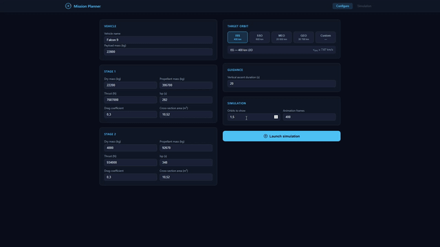

# 🚀 Mission Planner — Rocket Launch Simulator

A rocket launch simulator with a custom physics engine (Python) and an
interactive web interface (Flask + Plotly). Configure a multi-stage vehicle,
launch it toward a target orbit, and visualize the full 3D trajectory —
including ascent, orbital insertion, and Hohmann transfers.

<!-- First seconds of the 3D animation -->


## ✨ Features

- **Full physics engine**: numerical integration (`scipy.solve_ivp`) of the
  equations of motion, including gravity, thrust, atmospheric drag (ISA model),
  and Earth's rotation.
- **Guided ascent**: a three-phase gravity-turn profile (vertical → pitch-over →
  horizontal), automatically derived from the target orbit.
- **Orbital insertion**: circularization into a LEO parking orbit and, when the
  target requires it, a full **Hohmann transfer** to MEO/GEO with both Δv
  burns and transfer time computed.
- **Configurable vehicle**:
  - Real rocket presets (Falcon 9, Falcon Heavy, Ariane 5 ECA, Saturn V)
  - Dynamic stage count (add/remove stages)
  - Propellant type selector (RP-1/LOX, LH2/LOX, solid) with typical Isp values
- **Animated 3D visualization** (Plotly): Earth, trajectory, ascent ellipse,
  parking orbit, transfer ellipse, and final orbit, with playback controls
  (×1 / ×5 / ×20 / ×100) and a manual scrub slider.
- **Real-time telemetry HUD**: altitude, speed, acceleration (g), downrange
  distance, and vehicle mass.
- **Mission summary**: per-stage burnout times, apoapsis/periapsis,
  eccentricity, total Δv, orbital period, etc.

## 🖥️ Installation and usage

```bash
git clone https://github.com/<your-username>/<your-repo>.git
cd <your-repo>
pip install -r requirements.txt
python app.py
```

Open `http://localhost:5000` in your browser, configure the rocket and target
orbit, and click **Launch simulation**.

## 🧪 Project structure

```
├── app.py              # Flask routes and simulation orchestration
├── vehicle.py          # Rocket, Stage classes and guidance profile
├── solver.py           # Equations of motion and numerical integration
├── orbital.py          # Orbital mechanics (elements, circularization, Hohmann)
├── environment.py       # Gravity and atmosphere model (ISA)
├── constants.py         # Physical and orbital constants
├── templates/index.html # Configuration UI and 3D viewer
└── static/
    ├── main.js          # UI logic, presets, animation and HUD
    └── style.css         # Styling
```

## 🔭 Roadmap

See [`ToDoList.md`](ToDoList.md) for the full list. Upcoming milestones:

- Closed-loop PEG (Powered Explicit Guidance)
- Reentry and deorbit burn
- Trans-Lunar Injection (TLI)
- CFD integration (SU2 / OpenFOAM) for real aerodynamic coefficients
- PDF mission report export

## 📄 License

Personal project built for educational purposes / aerospace engineering
portfolio. Feel free to add whichever license you prefer here (MIT is a
common choice for this kind of project).