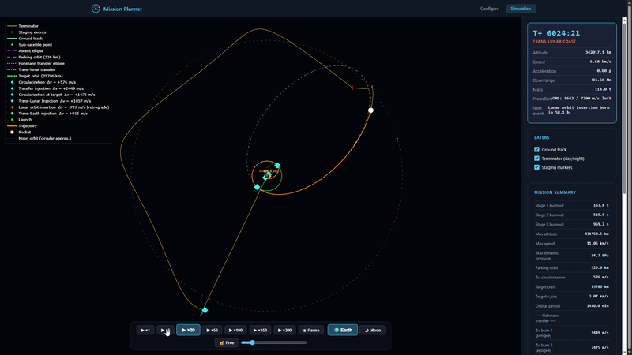

# 🚀 Mission Planner - Rocket Launch & Lunar Mission Simulator

[](https://github.com/Nava-19/orbital-mission-planner/actions/workflows/tests.yml)

A rocket launch and mission-design simulator built on a custom orbital
mechanics and atmospheric flight physics engine (Python), with an
interactive 3D web interface (Flask + Plotly). Configure a multi-stage
vehicle, fly it from liftoff through orbital insertion, and optionally on to
a full lunar mission - trans-lunar injection, lunar orbit insertion, and a
targeted return to Earth - all driven by real orbital mechanics, not
scripted animation.



> This project intentionally stays inside orbital mechanics and atmospheric
> flight dynamics. Vehicle aerodynamic coefficients (`Cd`, drag area) are
> user-supplied inputs, not computed from first principles - a companion CFD
> project is planned to fill that gap by generating those coefficients for
> imported vehicle geometries (see [Roadmap](#roadmap)).

## ✨ What it does

### Ascent & guidance
- **Full 2D physics engine**: numerical integration (`scipy.solve_ivp`) of
  gravity, thrust, atmospheric drag, and Earth's rotation, for
  user-configured multi-stage vehicles (arbitrary stage count, propellant
  type, thrust, Isp, drag).
- **Real rocket presets** (Falcon 9, Falcon Heavy, Ariane 5 ECA, Saturn V)
  with their real stage masses/thrust/Isp, or fully custom vehicles.
- **Closed-loop ascent guidance (PEG)** - a simplified Powered Explicit
  Guidance algorithm that re-solves the steering law every ~20s of flight
  from the vehicle's actual state (numerical shooting via
  `scipy.optimize.least_squares`, not a fixed pitch program) to hit the
  target parking orbit precisely, correcting itself in flight.

### Orbital operations
- Direct insertion or an automatic **Hohmann transfer** to a higher target
  orbit (LEO/SSO/MEO/GEO presets or a custom altitude).
- A shared **OMS Δv budget**: circularization, the Hohmann transfer,
  optional maneuvers, and the Moon-mission burns all draw from one
  user-configurable propellant budget for the payload/upper stage,
  clipped and reported honestly when it isn't enough - instead of treating
  every post-ascent burn as free.
- An optional **raise/lower orbit maneuver** after insertion.

### Lunar missions (Trans-Lunar Injection)
- The Moon is modeled as a **real second gravitational body** (not just a
  drawn target) - a circular, coplanar orbit computed directly (no external
  ephemeris dependency), with its gravity included in every phase of the
  physics engine. The spacecraft genuinely feels it: trajectories
  measurably deviate from a pure two-body Earth ellipse once nearby.
- **Phase-synced arrival**: the Moon's orbital phase is solved so it's
  actually at the transfer ellipse's apoapsis when the spacecraft gets
  there, instead of an arbitrary, unrelated position.
- **Lunar Orbit Insertion (LOI)**: a genuine vector-based capture burn
  (redirects to a truly tangential velocity relative to the Moon, not just
  a magnitude scale) for a real, stable, bound lunar orbit - verified to
  stay gravitationally bound over multiple laps, visibly perturbed
  lap-to-lap by Earth's gravity, as a real three-body orbit should be.
- A configurable number of lunar orbits, then an optional
  **Trans-Earth Injection (TEI)** - a numerical search (grid scan +
  least-squares refinement, evaluated against real Earth+Moon-gravity
  coasts, not an instantaneous two-body estimate) over the departure timing
  and burn size that targets a shallow, Apollo-like atmospheric entry angle
  (≈ -6° at the standard 122 km entry interface) - so the mission can hand
  off directly into ballistic reentry physics, no extra burns needed.

### Reentry
- A realistic **3-burn deorbit sequence** from a high parking orbit: return
  to a low parking altitude, circularize there, then a small, realistic
  atmospheric-entry burn - instead of one unrealistic direct dive.
- **Ballistic descent with drag**, using the same atmosphere model as
  ascent, through to surface impact detection.

### Atmosphere model
- ISA polytropic model (troposphere + lower stratosphere, 0–20 km) for
  physically-derived accuracy where temperature genuinely varies with
  altitude, handing off to a **PCHIP-smoothed fit through the standard
  reference exponential atmosphere table** (Vallado, *Fundamentals of
  Astrodynamics and Applications*) from 20 km through 1,000 km - matching
  the reference table exactly at every published node, with no artificial
  jumps in local scale height between them (see
  [Validation](#validation-against-reference-data)).

### Visualization & reporting
- Interactive 3D trajectory view (Plotly) with ground track, day/night
  terminator, staging event markers, and prograde/retrograde Δv burn
  markers for every burn in the mission.
- Selectable camera framing: Earth-centered, Moon-centered (only offered
  when a mission actually goes there), or free camera.
- Adjustable playback speed (×1 to ×200) and a scrub bar.
- One-click **PDF mission report** (client-side, via `jsPDF` +
  `Plotly.toImage` - no server-side rendering dependency) with the
  trajectory view, mission summary, orbital elements, and full burn
  sequence.

## Validation against reference data

Simplified simulators are easy to build and easy to get subtly wrong. A few
concrete checks run against this engine, rather than "it looks right":

| Quantity | This simulator | Reference | Source |
|---|---|---|---|
| Atmospheric density, every table node 20–1000 km | exact match | Vallado exponential atmosphere table | Vallado, *Fundamentals of Astrodynamics and Applications* |
| Falcon 9 ascent max dynamic pressure | ≈ 33 kPa | ~30–40 kPa for real Falcon 9 flights | public flight data |
| Trans-Lunar Injection Δv (LEO → Moon distance) | ≈ 3.08 km/s | ~3.1–3.2 km/s | historical TLI burns |
| Lunar Orbit Insertion Δv | ≈ 0.7–1.0 km/s (orbit-size dependent) | ≈ 1.0 km/s (Apollo LOI burns) | Apollo mission reports |
| Reentry flight path angle at 122 km entry interface | tuned to ≈ -6° to -8° | ≈ -6.5° (Apollo entry corridor) | Apollo mission reports |

None of these were curve-fit to hit these numbers - they fell out of the
underlying physics (thrust/Isp/mass integration, vis-viva, patched
two-body dynamics) once it was implemented correctly, which is what makes
them a meaningful check rather than a tautology.

## Getting started

```bash
git clone git@github.com:Nava-19/orbital-mission-planner.git
cd orbital-mission-planner
pip install -r requirements.txt
python app.py
```

Then open `http://localhost:5000`, configure a vehicle and target orbit
(or pick a preset), and launch.

### Running the tests

```bash
pip install -r requirements-dev.txt
pytest tests/ -v
```

## Project structure

```
app.py            Flask endpoint - orchestrates a full mission (ascent,
                   orbital insertion, optional maneuver/TLI/reentry) and
                   assembles the JSON payload the frontend renders
vehicle.py         Rocket/Stage classes, PEG closed-loop ascent guidance
solver.py          Equations of motion, numerical integration (ascent,
                   coast, ballistic reentry with drag)
orbital.py         Orbital elements, Hohmann transfer, circularization,
                   Moon position/velocity/gravity
environment.py     Atmosphere density model, gravity
constants.py       Physical constants (Earth, Moon, atmosphere)
templates/         Flask/Jinja page shell
static/main.js     Frontend: vehicle config UI, 3D visualization (Plotly),
                   animation, PDF mission report
static/style.css   Styling
tests/             Automated test suite (pytest) - atmosphere model,
                   orbital elements, Hohmann transfer, energy/angular
                   momentum conservation, reentry impact detection
.github/workflows/ CI - runs the test suite on every push/PR
docs/               Demo assets
```

## Known limitations

Documented in detail, with the reasoning behind each simplification, in
[`ToDoList.md`](ToDoList.md). The short version:

- **2D, single-plane physics** - no orbital inclination or 3D geometry.
- **Moon**: circular, coplanar, arbitrary phase at mission start - not real
  ephemeris data (a Skyfield-based upgrade is a planned follow-up).
- **Impulsive burns** - every maneuver is an instantaneous Δv, not a
  finite-duration throttled burn.
- **Point-mass ballistic reentry** - no lift, heating, or parachute model.
- **Vehicle drag coefficients are user-supplied inputs**, not derived from
  vehicle geometry (see the CFD companion project note above).

## Roadmap

See [`ToDoList.md`](ToDoList.md) for the full, itemized roadmap and
implementation notes. At a glance:

- Short term: J2 perturbation, save/load mission configs, ground-station
  visibility windows.
- Longer term, as a **separate companion project**: a CFD pipeline
  (SU2/OpenFOAM) to compute real aerodynamic coefficients for imported
  rocket/vehicle geometries, feeding back into this simulator's drag model
  instead of user-supplied `Cd`/area values.

## Tech stack

Python (Flask, NumPy, SciPy) · Plotly.js · jsPDF

## License

MIT - see [`LICENSE`](LICENSE).